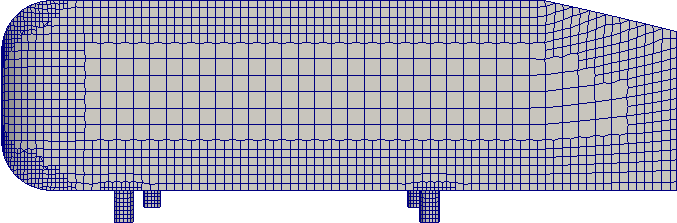

# Ahmed Body Deformation Test case

In this test case we show a mesh morphing technique based on Radial Basis Function interpolation for an Ahmed body Geometry. The implementation is based on [**OpenFOAM**](https://www.openfoam.com/) opensource software and on the opensource library [**ITHACA-FV**](https://github.com/mathLab/ITHACA-FV). In particular the test case focuses on the modification of the slope of the rear part of the body.

<p align="center">
    
</p>

## 0. Description of ITHACA-FV
**ITHACA-FV** is an implementation in **OpenFOAM** of several reduced order modelling techniques. **ITHACA-FV** is designed for [**OpenFOAM 6.0**](https://openfoam.org/version/6), [**OpenFOAM 5.0**](https://openfoam.org/version/5-0), [**OpenFOAM v1812**](https://www.openfoam.com/releases/openfoam-v1812/) and [**OpenFOAM 1906**](https://www.openfoam.com/releases/openfoam-v1906/) but it can be easily adapted also to other versions of OpenFOAM. 

**ITHACA-FV** can also be used as a basis for more advanced projects that would like to assess the capability of reduced order models in their existing **OpenFOAM**-based software, thanks to the availability of several reduced order methods and algorithms.

Linear and non-linear algebra operations which are not already implemented in OpenFOAM are performed with the external library [**Eigen**](http://eigen.tuxfamily.org/index.php?title=Main_Page). The source code of Eigen 3.3.7 is provided together with ITHACA-FV and is located in the [src/thirdyparty/Eigen](./src/thirdparty/Eigen) folder.  For the EigenValue decomposition it is also possible to rely on the [**Spectra-0.7.0**](https://spectralib.org/) library and the source code is provided in the [src/thirdyparty/spectra](./src//thirdparty/spectra) folder.

**ITHACA-FV** has been tested on ubuntu 16.04, CentOS 7, ArchLinux but can be easily compiled on any linux distribution with a compiled version of OpenFOAM 6.0, OpenFOAM 5.0 or OpenFOAM 1812.

## 1. Prerequisites
**Installation** of one of the following versions of OpenFOAM:
* [**OpenFOAM 5.0**](https://openfoam.org/version/5-0)
* [**OpenFOAM 6.0**](https://openfoam.org/version/6) 
* [**OpenFOAM 1812**](https://www.openfoam.com/releases/openfoam-v1812/)
* [**OpenFOAM 1906**](https://www.openfoam.com/releases/openfoam-v1906/) 

**Installation** of the [**ITHACA-FV**](https://github.com/mathLab/ITHACA-FV) library. Instructions can be found at the GitHub webpage of the library.

## 2. Usage of the test case

### 1. Clone the folder [**AhmedDeformation**](https://github.com/giovastabile/AhmedDeformation):
```
git clone https://github.com/giovastabile/AhmedDeformation
```
### 2. Open a terminal into the folder;
### 3. Source both the **OpenFOAM** and the **ITHACA-FV** bashrc files. The specific paths depend on the location where you cloned the folder and on the location where your version of OpenFOAM is stored:
```
source $YOUR_OPENFOAM_DIR/etc/bashrc
source $YOUR_ITHACA-FV_DIR/etc/bashrc
```
### 4. Compile the test case by the use of the command:
```
wmake
```
### 4. Run the test case by the use of the command:
```
testAhmed
```
More details about the way the code works are reported into che file `testAhmed.C`. All the deformed geometries are automatically exported into the folder `ITHACAoutput/Offline` and they can be shown by the use of **ParaView**.

## 3. Authors and contributors

Codes are currently developed and mantained at [SISSA mathLab](http://mathlab.sissa.it/) by [Dr. Giovanni Stabile](mailto:gstabile@sissa.it) and by [Matteo Zancanaro](mailto:mzancana@sissa.it) under the supervision of [Prof. Gianluigi Rozza](mailto:gianluigi.rozza@sissa.it).

Contact us by email for further information or questions or open an ''Issue'' on this GitHub webpage.

## 4. How to cite

Most of the aspects related to this test case are contained in [<b> stabile2020efficient </b>](https://doi.org/10.1002/nme.6324).
For this reason, if you use this software, please consider citing the mentioned work, reported in the following bibtex entry:

```
@article{stabile2020efficient,
  title={Efficient geometrical parametrization for finite-volume-based reduced order methods},
  author={Stabile, Giovanni and Zancanaro, Matteo and Rozza, Gianluigi},
  journal={International Journal for Numerical Methods in Engineering},
  volume={121},
  number={12},
  pages={2655--2682},
  year={2020},
  publisher={Wiley Online Library}
}
```
and cite the [ITHACA-FV website](http://mathlab.sissa.it/ITHACA-FV).


## 5. License
These codes are freely available under the GNU LGPL, version 3.
